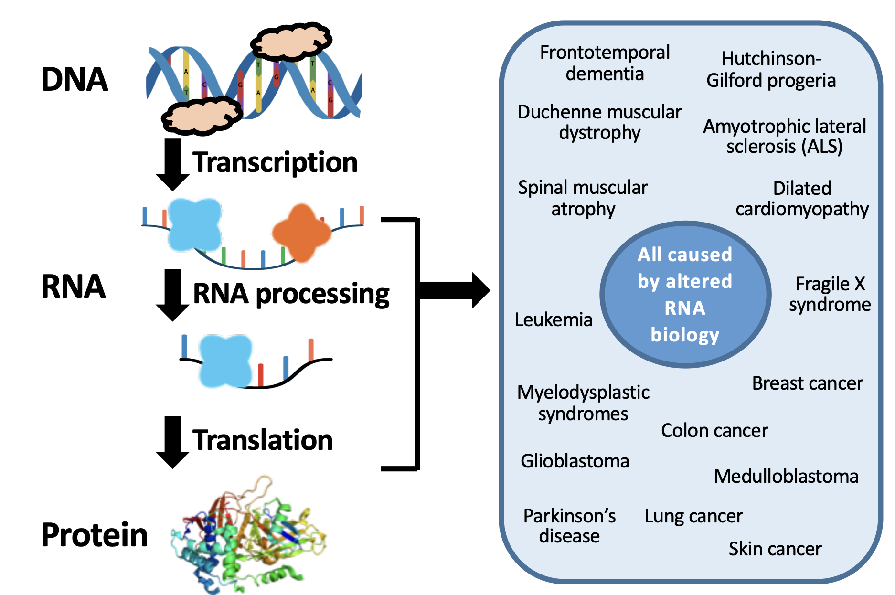
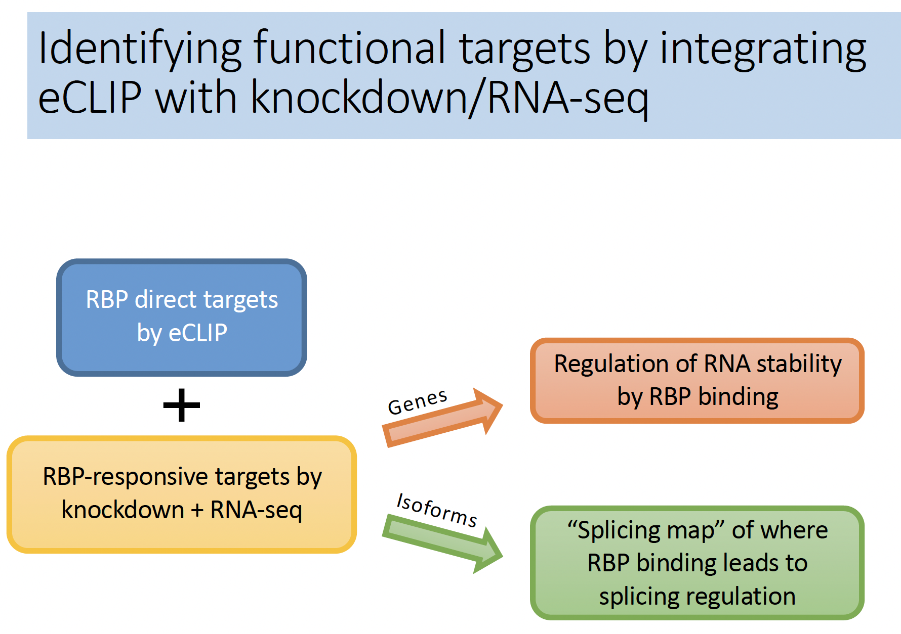

# curatedENCORE

This repo coordinates material for an AnVIL workspace on the ENCORE project.

## Some motivating slides from Eric van Nostrand's [NHGRI tutorial](https://www.genome.gov/Pages/Research/ENCODE/Tutorials/2018_ASHG_Workshop/ENCODE_RBP_Van_Nostrand_2018_10_16.pdf)

<!--
RBPresponsive.png	diseases.png		localizeImages.png
RNAstability.png	eClipPlusLoc.png
-->
